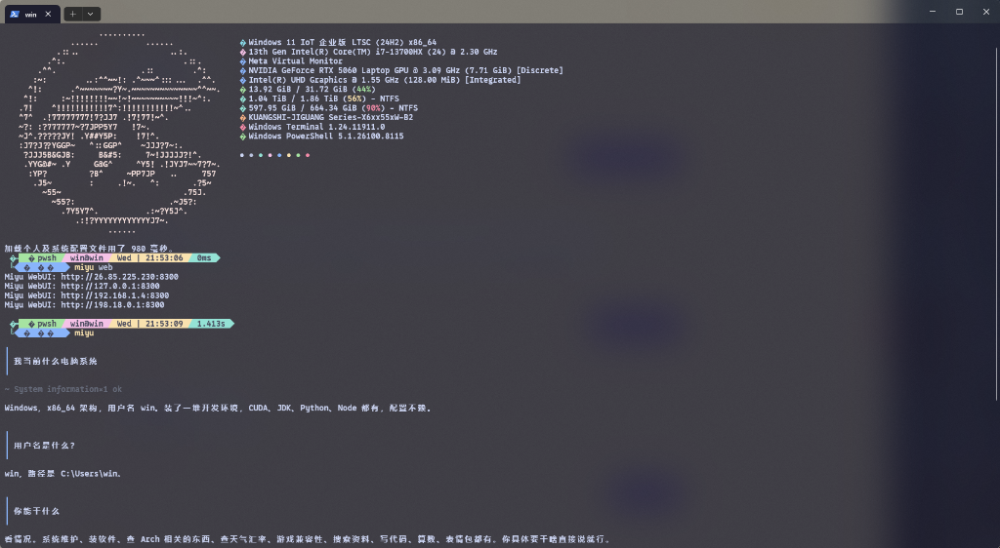

<p align="center">
  
</p>

# Miyu for Windows

**Miyu (美由)** —— 一个活在终端里的二次元 AI 少女助手，现已全面原生适配 **Windows 10 / Windows 11 (x64)**！



---

## 🌟 核心特性 (Windows 特化适配)

- 🚀 **绿色单文件部署**：无需安装 Python、Node.js 或庞大的运行时，单个 `miyu.exe` 拖入系统环境变量即可开箱即用。
- ⚡ **原生 Windows IPC 架构**：采用 TCP 回环通信与 Windows LockFileEx 排他锁机制，彻底告别 POSIX/Unix Socket 兼容难题，极速就绪。
- 🎨 **炫彩 TUI 与 WebUI 界面**：原生支持 Windows Terminal 4-bit/真彩色显示；内置 WebUI 网页控制台 (`http://127.0.0.1:8300`)。
- 🤖 **全能助手**：支持 Coding 辅助、日常对话、系统排障、聊天记录恢复、知识库 (KB) 管理及大模型参数调优。

---

## 📦 快速安装与配置

### 途径 1：免环境单文件快速部署（推荐）

1. 下载编译好的二进制压缩包并解压得到 `miyu.exe`。
2. 将 `miyu.exe` 移动到您常用的工具目录（例如 `C:\Tools\` 或 `C:\Program Files\Miyu\`）。
3. **添加环境变量**（方便在任意终端中直接输入 `miyu`）：
   - 按 `Win + R` 打开运行窗口，输入 `sysdm.cpl` 回车。
   - 切换到 **“高级”** -> **“环境变量”** -> 双击 **Path** 变量 -> **新建** -> 填入 `miyu.exe` 所在的文件夹路径。
4. 打开 PowerShell 或 CMD 验证：
   ```powershell
   miyu --help
   ```

---

### 途径 2：从源码编译构建 (开发者模式)

1. **安装 Rust 开发环境**：
   在新电脑的 PowerShell 中运行：
   ```powershell
   winget install Rustlang.Rustup
   ```
   *安装完成后请重启一次 PowerShell 窗口。*

2. **克隆源码并编译**：
   ```powershell
   git clone https://github.com/SHORiN-KiWATA/Miyu.git
   cd Miyu
   cargo install --path .
   ```

---

## 🚀 常用指令指南

在 PowerShell / CMD 或 Windows Terminal 中即可直接使用以下命令：

| 命令 | 描述 |
| :--- | :--- |
| `miyu` | 启动控制台交互式 REPL 模式，与 Miyu 实时对话 |
| `miyu web` | 启动 Web 界面服务（默认访问地址：`http://127.0.0.1:8300`） |
| `miyu ask "你的问题"` | 单次提问模式，在终端直接输出回答 |
| `miyu config` | 打开配置界面（可修改语言、API Key、模型参数等） |
| `miyu paths` | 显示 Windows 系统下的配置文件与数据存储路径 |
| `miyu daemon start` | 手动启动后台统一守护进程 |
| `miyu daemon status` | 查看守护进程与运行状态 |
| `miyu daemon stop` | 关闭后台守护进程 |

---

## 📁 Windows 存储路径说明

Miyu 恪守 Windows 文件系统规范，所有用户配置文件和缓存数据均存储于用户主目录下：

* **应用根目录**：`C:\Users\<您的用户名>\.miyu\`
* **配置文件**：`C:\Users\<您的用户名>\.miyu\config\config.jsonc`
* **数据目录**：`C:\Users\<您的用户名>\.miyu\data\`
* **状态与缓存**：`C:\Users\<您的用户名>\.miyu\state\` 及 `cache\`

---

## ❓ 常见问题 (FAQ)

#### Q1: 运行 `miyu web` 提示防火墙允许访问？
* **答**：这是 Windows 系统的安全机制。请勾选 **“专用网络”** 并点击 **“允许访问”**，以确保本地浏览器能够顺畅访问 `127.0.0.1:8300`。

#### Q2: 提示 `error: 拒绝访问 (os error 5)` 怎么办？
* **答**：项目已在底层完成 Windows 权限锁定与句柄降级适配。如果提示该错误，请确保没有其他旧版 `miyu.exe` 正在后台占用数据文件，或在任务管理器中结束旧进程后再试。

#### Q3: 推荐使用什么终端工具？
* **答**：强烈推荐使用 **[Windows Terminal](https://aka.ms/terminal)**（可在微软应用商店免费下载），具备极佳的颜表情、彩色文本和二次元字符渲染效果。

---

<p align="center">
  祝您与 Miyu 交流愉快！(๑•̀ㅂ•́)و✧
</p>
